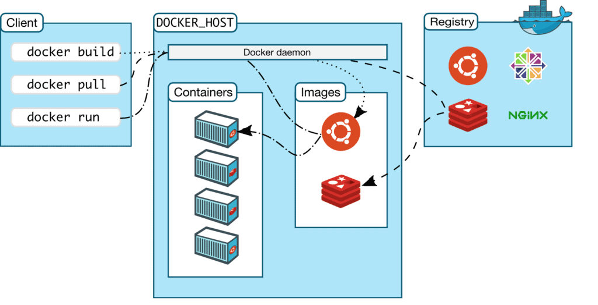

What is Docker?

Docker is a platform designed to make it easier to develop, deploy, and run applications by using containers. Containers allow a developer to package up an application with all parts it needs, such as libraries and other dependencies, and ship it all out as one package. This ensures that the application will run on any Linux machine, regardless of any customized settings that machine might have that could differ from the machine used for writing and testing the code.

Key components and concepts of Docker include:

1. **Containerization:** Docker uses container technology, which encapsulates the application and its dependencies into a lightweight, portable container. Containers provide consistency across different environments and ensure that the application runs the same way in development, testing, and production.

2. **Docker Engine:** The Docker Engine is the core software responsible for building and running containers. It includes a daemon process (`dockerd`) that manages containers, images, networks, and volumes. Users interact with the Docker Engine through the Docker CLI (Command Line Interface) or a GUI.

3. **Docker Image:** A Docker image is a lightweight, standalone, and executable package that includes the application code, runtime, libraries, and system tools required to run an application. Images are used to create containers.

4. **Docker Container:** A Docker container is an instance of a Docker image. It runs as a standalone, isolated process, and it encapsulates the application and its dependencies. Containers provide consistency and reproducibility across different environments.

5. **Docker Hub:** Docker Hub is a cloud-based registry service where you can share and distribute Docker images. It serves as a central repository for storing and managing Docker images, making it easy for developers to share and collaborate on containerized applications.

https://hub.docker.com/

6. **Docker Compose:** Docker Compose is a tool for defining and running multi-container Docker applications. It uses a YAML file to configure application services, networks, and volumes, enabling developers to define complex application stacks and deploy them easily.

7. **Orchestration:** Docker provides orchestration features for managing and scaling containerized applications. Docker Swarm and Kubernetes are popular tools for orchestrating containers in a cluster, ensuring high availability, load balancing, and efficient resource utilization.

Docker simplifies the process of building, shipping, and running applications, making it a widely used technology in the world of software development and deployment.

