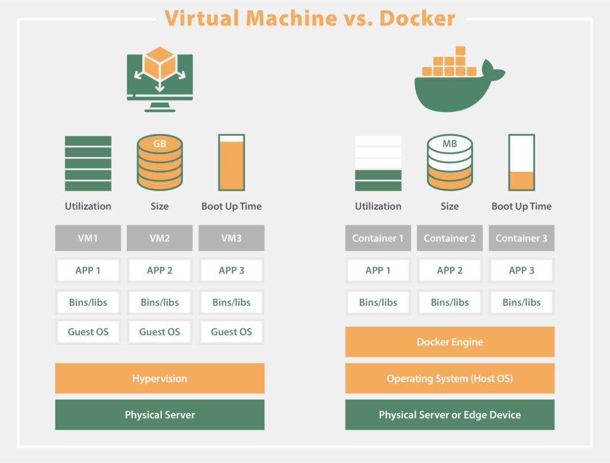

Docker Advantages?!

Docker offers several advantages for software development, deployment, and operations. Here are some key benefits:

1. **Portability:**
   - Containers encapsulate applications and their dependencies, ensuring consistency across different environments. This portability makes it easy to develop, test, and deploy applications in various settings, from a developer's laptop to a production server.

2. **Isolation:**
   - Containers provide process and file system isolation, allowing applications to run independently without interfering with each other. This isolation improves security, reduces conflicts between dependencies, and enables the coexistence of multiple applications on the same host.

3. **Efficiency:**
   - Containers share the host OS kernel and use resources more efficiently compared to traditional virtualization. They have a lower overhead, resulting in faster startup times, reduced memory footprint, and improved overall system performance.

4. **Consistency:**
   - Docker ensures consistency between development, testing, and production environments. Developers can create a container image containing the application and its dependencies, and this same image can be used across different stages of the development lifecycle.

5. **Rapid Deployment:**
   - Containers can be started or stopped quickly, facilitating rapid application deployment and scaling. This agility is particularly valuable in dynamic and fast-paced development environments where quick iteration and release cycles are essential.

6. **Versioning and Rollback:**
   - Docker images can be versioned, enabling developers to track changes and roll back to previous versions if needed. This versioning capability supports easier collaboration, troubleshooting, and the ability to revert to a known working state.

7. **DevOps and Continuous Integration/Continuous Deployment (CI/CD):**
   - Docker facilitates DevOps practices by providing a consistent environment throughout the development and deployment pipeline. Containers can be seamlessly integrated into CI/CD workflows, enabling automated testing, deployment, and continuous delivery.

8. **Resource Optimization:**
   - Containers share the host OS kernel and utilize resources more efficiently than traditional virtual machines. Multiple containers can run on the same host without the need for separate OS instances, leading to better resource utilization and cost savings.

9. **Ecosystem and Community Support:**
   - Docker has a large and active community, contributing to a rich ecosystem of pre-built images and tools. Docker Hub serves as a centralized repository for sharing and discovering container images, streamlining the distribution of software components.

10. **Microservices Architecture:**
    - Docker is well-suited for microservices architectures, where applications are decomposed into smaller, independently deployable services. Containers make it easier to manage and scale individual microservices, promoting flexibility and scalability.

11. **Orchestration and Scaling:**
    - Docker provides orchestration tools like Docker Swarm and Kubernetes for managing and scaling containerized applications. These tools automate tasks such as load balancing, service discovery, and container scaling, simplifying the management of complex deployments.

Docker's advantages lie in its ability to enhance consistency, portability, efficiency, and collaboration throughout the software development and deployment lifecycle.

