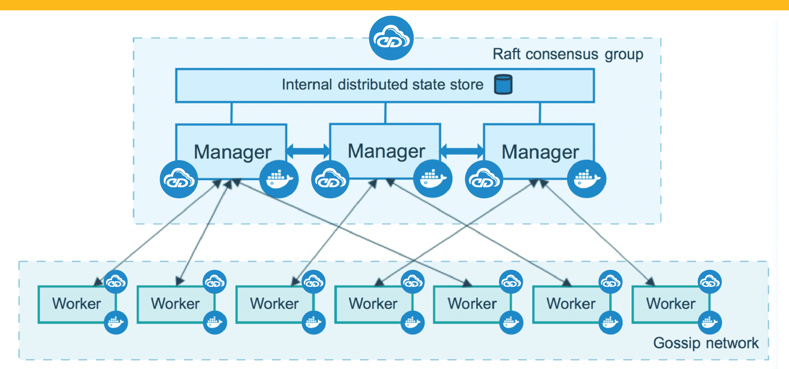

Docker Swarm?!

Docker Swarm is a native clustering and orchestration solution for Docker. It enables you to create and manage a swarm of Docker nodes, turning them into a single, virtual Docker host. This virtual host can be used to deploy and manage distributed, multi-container applications at scale.

Key features and concepts of Docker Swarm include:

1. **Node:**
   - A node in Docker Swarm is an individual Docker host that participates in the swarm. Nodes can be physical machines or virtual machines. They work together to form a unified cluster.

2. **Manager Node:**
   - In a Docker Swarm, one or more nodes are designated as manager nodes. Manager nodes are responsible for handling the orchestration of services, managing the swarm state, and ensuring the overall health and availability of the cluster.

3. **Worker Node:**
   - Nodes that are not manager nodes are classified as worker nodes. Worker nodes run containers and execute the tasks assigned to them by the manager nodes. Worker nodes do not participate in the orchestration decisions but execute the workload.

4. **Service:**
   - A service in Docker Swarm is a definition for a containerized application, including the image, configuration, and desired scale. Services allow you to define the characteristics of your application and let Docker Swarm manage the deployment and scaling.

5. **Task:**
   - A task is the smallest unit of work in Docker Swarm. Each task represents a running container on a worker node. The manager nodes schedule and distribute tasks to worker nodes based on the defined service specifications.

6. **Load Balancing:**
   - Docker Swarm provides built-in load balancing for services. Traffic directed to a service is automatically load-balanced across all available replicas of the service.

7. **Overlay Network:**
   - Docker Swarm uses overlay networks to enable communication between containers running on different nodes. Overlay networks provide multi-host connectivity, allowing containers to communicate seamlessly as if they were on the same host.

8. **Swarm Mode:**
   - Docker Swarm operates in "Swarm mode," a built-in orchestration mode that simplifies the management of containerized applications across a cluster. Swarm mode introduces new commands (`docker swarm`) and capabilities for creating and managing swarms.

9. **Stack Deployment:**
   - Docker Swarm supports the deployment of entire applications, including multiple services, using Docker Compose files. This allows you to define and deploy complex, multi-service applications in a consistent manner.

10. **High Availability:**
    - Docker Swarm provides high availability by distributing manager nodes across multiple hosts. If a manager node fails, another manager node takes over, ensuring the continued operation of the swarm.

11. **Security:**
    - Swarm incorporates security features such as mutual TLS authentication for communication between nodes, ensuring that communication within the swarm is secure.

Docker Swarm simplifies the deployment and scaling of containerized applications across a cluster of machines, making it a suitable solution for organizations looking to manage containers in a production environment. While Docker Swarm is a powerful and easy-to-use orchestration tool, it's worth noting that Kubernetes has gained significant popularity and is another popular choice for container orchestration in more complex scenarios.

